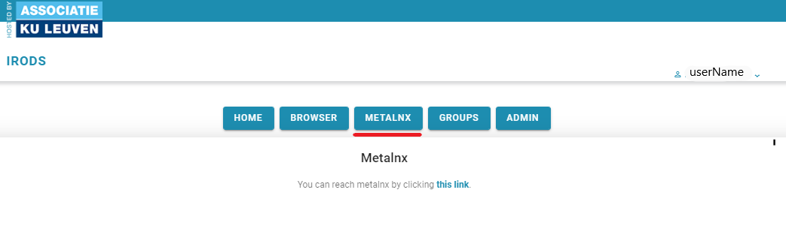

# Metalnx Portal Client for KU Leuven Users

*Prerequisites:*  
*-A KU Leuven u-account*  

Metalnx is a graphical user interface and serves as a client to iRODS. It helps to simplify most administration, collection management, and metadata management tasks removing the need to memorize the long list of iCommands. It allows users to manage content and metadata associated with content.

You can reach the Metalnx portal by clicking on the Metalnx tab at your zone portal (https://{YOURZONE}.irods.icts.kuleuven.be).

You will be redirected to the KU Leuven authentication page where you will have to login with your u-account. After you are forwarded to the KU Leuven iRODS portal, you need to click to the Metalnx link.

Or you can use the direct link of Metalnx (https://{YOURZONE}.irods.icts.kuleuven.be/metalnx).

The Metalnx portal is composed of two panes. The left pane is a menu with different options. The right pane provides functionalities based on the selected item in the menu.

**Collections**: This tab allows you to browse through your collections. A collection is the logical representation of a group of data objects (files), similar to folders or directories on your normal PC. A collection can also contain subcollections. Under this tab, we can perform all data object and collection related activities:
 
- Uploading files  
- Moving files/collections  
- Copying files/collections  
- Renaming files/collections  
- Applying metadata templates
- Downloading files  

Behind any collection or file, you can press 'View info' for the following options:

- Adding metadata to files/collections  
- Adding files/collections to favorites  
- Setting permissions  
- Getting previews of files  

This is the tab you will be using the most in Metalnx.

**Search**: This tab gives search options based on various parameters.

**Templates**: We can here create our own metadata templates or import a template from outside in a json format. These can then be applied to files or collections.

**Shared Links**: Here you can see the links to data objects and collections shared with you by other users.

**Favorites**: Here you can see your bookmarked collections and files.

**Tickets**: The ticket mechanism is another way to provide other people, including non-iRODS users, access to data objects  or collections . So, this tab allows you to see all the tickets you have created in addition to making new tickets with the ‘using ticket’ button. Because of the defined workflows for the Eximious project, it is kindly requested not to use this functionality.

**Public**: Here you can reach the public area collections. The public collection gives opportunity to share data easily with others. However, not recommended to use it for project data because all users can have access to this collection.

**Trash**: Here you can see the files and collections moved to trash bin. All the collections and data objects that are deleted moves to the trash collection and they are permanently cleaned when they are older than 15 days. You can also use ‘Empty Trash’ button to empty the trash collection completely.

#  Exercises

Let's do the exercises below! 

You can find the files used for the exercises in the [git repository](https://github.com/hpcleuven/KULeuven-iRODS-User-Training) of this training, in the 'data' folder. 

You can download the repository as a Zip-file by clicking on the green 'code' button and selecting 'Download ZIP'.   
Alternatively, you can clone the repository from the command line.  

**Exercise 1: uploading and organizing**

- Download the file inflation.txt from data/economy
- Create two collections called 'earth_science' and 'economy'.
- Upload inflation.txt to the collection 'earth_science'.
- You suddenly relialize that what you just did doesn't make sense. This file belongs in 'economy'! Move the file to that collection.
- Move into the 'economy' collection and check whether the file is actually there.
- Move one level back and remove the 'earth_science' collection.

   
  
Solution
 

You start this exercise in the 'collections' tab.  
- Use the 'create collection' button to create the collection 'earth_science'.    
  This is the first of the four buttons on the upper right corner of the screen.     
  Make the collection 'economy' in the same way.    
- Click on the newly made 'earth_science' collection.  
- Click on the upload button (third of the four buttons in the upper right corner).    
  In the popup that opens, you can search the inflation.txt file on your local pc.  
- Click on the tickbox next to inflation.txt. From the action menu, select 'move'.  
  In the popup that appears, select your home collection, then 'economy'. Click the 'move' button.
- Click on 'home' just above the navigation tool. 
- Click on the tickbox next to the 'earth_science' and choose 'delete' from the action menu.

       

  
**Exercise 2: Editing and downloading**

- You realise there is a mistake in the uploaded data object inflation.txt. 
  Edit the data object so the inflation for 2021 is 1.4%. 
- Rename the data object to 'inflation_corrected.csv'.
- Download the edited file from iRODS.

    
Solution

You start this exercise in the 'collections' tab.  

- Go to the economy folder and click on 'view info' next to inflation.txt. 
- Click the 'preview' tab. There, you can edit the file and save your changes.
- Select 'rename' on the action dropdown, and type 'inflation_corrected.csv'.
- Click on the download button (rightmost button in the top right corner).

**Exercise 3: managing permissions**  
Download the files patient1.csv and anonymized.csv from data/lifescience.  

- Make a collection called 'lifescience' in your home and upload both files to it.
- Give your group read access to the collection lifescience, recursively.
- Oh no, we forgot something! While the data in anonymized.csv is anonymized, the other file contains sensitive data!  
  Remove the read permissions for the group from patient1.csv.
- Since the data in patient1.csv is sensitive, only colleagues who really need it can have access.   
  Choose one of your colleagues and give this person write access to the file.
- Check whether the permissions of both files are correctly set.

    
Solution

You start this exercise in the 'collections' tab.  

- Use the 'create collection' button to create the collection 'lifescience'.    
  This is the first of the four buttons on the upper right corner of the screen.
- Click on the collection 'lifescience'.
- Use the upload button (third of the four buttons in the upper right corner) to upload both files.
- Click on the 'info' button (second of the four buttons in the upper right corner). This will bring you to the info page of the collection you are currently in.  
- Select the permissions tab, click on the '+permissions' button and give your group read permissions. Be sure to tick the box 'Apply to subcollections and files'.

- Go back to your home collection, and then to the lifescience collection. Click on the button 'view info' next to patient1.csv.
- Go to the permissions tab. You should see here that your group has read permissions. Set these to 'none'
- Click on the '+permissions' button and give a colleague write permissions. This should appear in the list of permissions.
- Go back to the lifescience collection, click on 'view info' next to anonymized.csv, and click on the permissions tab. Your group should still have read access.  

**Exercise 4: working with metadata**  
Download the files corpus1.txt, corpus2.txt and corpus3.txt from data/languages.  
- Make a collection called 'languages' and upload the files to it.
- Add the following AVU's to the files:
    - Attrbute 'language' and value 'dutch' to corpus1.txt
    - Attrbute 'language' and value 'french' to corpus2.txt
    - Attrbute 'language' and value 'latin' to corpus3.txt
- Oops, we made a mistake! Open the file corpus2.txt, and look what the language is.   
  Overwrite the current AVU with one with the correct value.

    
Solution

    
You start this exercise in the 'collections' tab.  

- Use the 'create collection' button to create the collection 'languages'.      
  This is the first of the four buttons on the upper right corner of the screen.  
- Click on the languages collection.  
- Use the upload button (third of the four buttons in the upper right corner) to upload the three files.  
- Repeat the following steps for each of the files:  
    - Click on the 'view info' icon next to the file.
    - Click on the 'metadata' tab.
    - Click on the '+metadata' button, fill in the fields, and click 'save'.
    - Go back to the languages collection.
- Go back to the 'view info' page of corpus2.txt.  
  Click on the 'preview' tab to see which language corpus2.txt is written in (English).  
  On the metadata tab, you'll see the avu 'Language: French'.   
  Click on the 'edit' button to change this to 'English' and then save.

**Exercise 5: metadata templates**

- Download the file biology/bird.JPG and upload it on Metalnx.  
- Create a private metadata template with the name 'Biology_images'. Give it an appropriate description.  
  It should contain the following attributes:  
    -Type, with default value 'plant/animal'  
    -Mammal, with default value 'no'  
    -Flies, with default value 'no'   
- Apply this template to bird.JPG.   

    
Solution

You start this exercise in the 'collections' tab.  

- Use the upload button (third of the four buttons in the upper right corner) to upload bird.JPG.
- Go to the 'Templates' tab and click on 'add template'.
- Give in the name 'Biology_images_<your_name>', a short description, and set Access to 'private'.
- Click on the '+metadata' button to add the three AVU's. You can leave the unit fields blank.
- Go to the collections tab. Check the tickbox next to bird.jpg and select 'apply template' on the action menu. 
- Select the newly made biology template. 
- Switch the value of 'flies' to 'yes' and the value of 'type' to 'animal'. 
- You can select the 'view info' button next to bird.jpg to see the added metadata.

