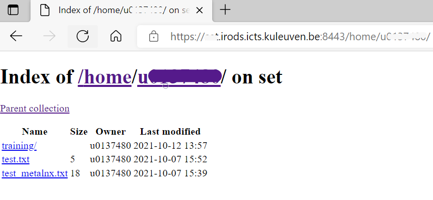
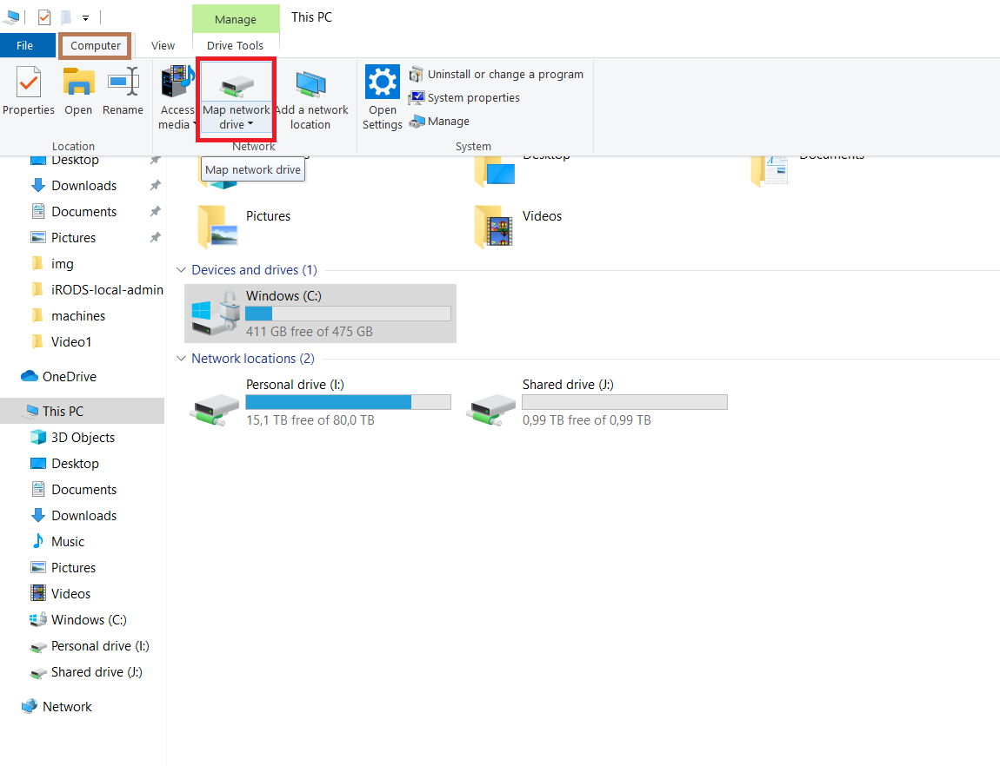
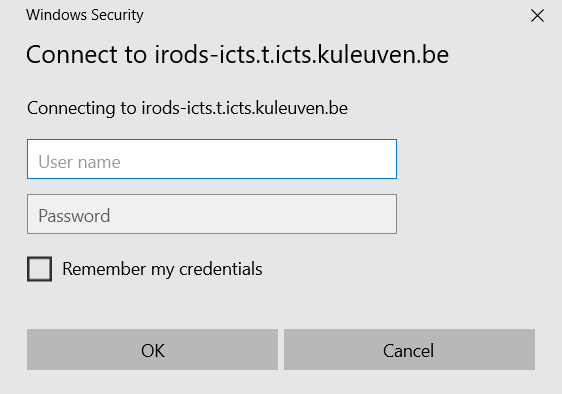
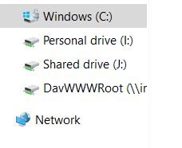

# Webdav client for iRODS

*Prerequisites:*  
*-A KU Leuven u-account*  

WebDAV stands for Web Distributed Authoring and Versioning, which is an extension to HTTP, the protocol that web-browsers and webservers use to communicate with each other. In other words, WebDAV is a method for remotely managing files over the internet. With WebDAV, we can access files stored in the KU Leuven iRODS repository by using the same interface as we do with our local files.

The module that we use for our iRODS connection is called [Davrods](https://github.com/UtrechtUniversity/davrods). Davrods is an Apache WebDAV interface to iRODS developed by the University of Utrech and it provides access to iRODS servers using the WebDAV protocol. It is a bridge between the WebDAV protocol and iRODS.

## Web Browser-Directory Index

A connection through Davrods is available at https://{YOURZONE}.irods.icts.kuleuven.be:8443/  address. After you click the link you can log in using your u-account and the temporary password that is displayed when you connect to the [KU Leuven iRODS login page]: (https://{YOURZONE}.irods.icts.kuleuven.be/)

Once you enter your user name and the password, you will see the exact same directory structure as you see in your iRODS server.

You can now browse the directories, visualize some files (i.e: text files or images) and download files but you will not be able to upload files.

## Mapping drive-WebDAV

It is also possible to mount your iRODS directories as a network drive using the WebDav interface. 

How to access iRODS using WebDAV on a Windows 10 pc:

- Go to File Explorer and select This PC on the left hand pane.
- Select Computer from the top ribbon.
- Click on Map Network Drive.

- Choose the drive name you want to use. For example Z:
- Type `https://{YOURZONE}.irods.icts.kuleuven.be:8443/home` in the folder area. 

- Click finish button.

- Enter your user u-account.
- Paste the password you obtained in the login page.
- Click “ok”.

- You should be able to see your connection in network locations.

Once you’ve connected, the WebDAV directory is mounted in your local pc. After you click on your driver you will see your iRODS collections and data objects. You can now start adding, editing, deleting files in this directory from the comfort of your computer.

## Other WebDav clients

On windows systems the WebDav protocol can be used with programs as [WinSCP](https://winscp.net/eng/index.php) or [Cyberduck](https://cyberduck.io/). The later works also for MacOS.
On Linux systems a good alternative is the [Cadaver client](http://www.webdav.org/cadaver/)