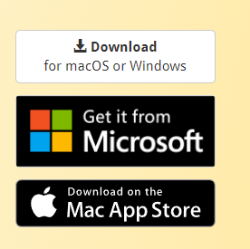
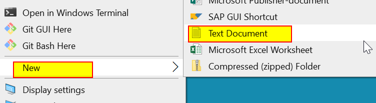
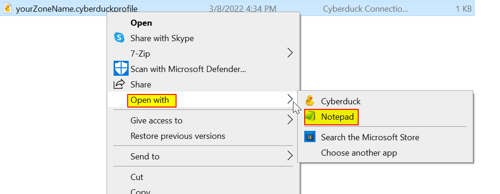
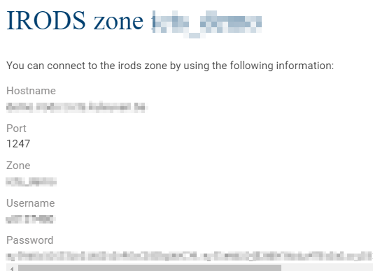
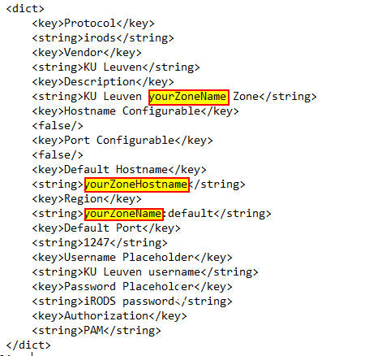
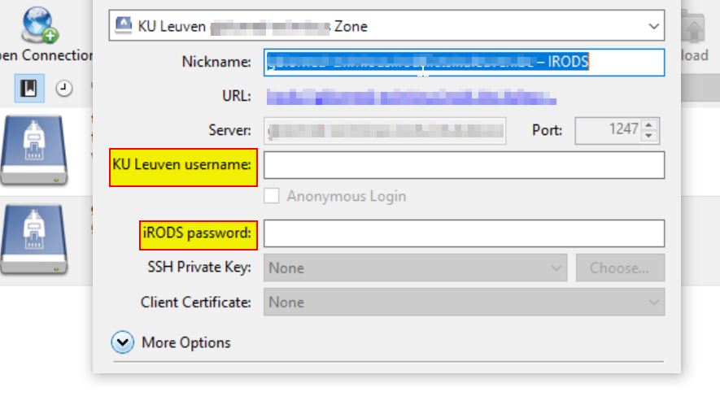

# Cyberduck Client for iRODS

*Prerequisites:*  
*-A KU Leuven u-account*  

[Cyberduck](https://cyberduck.io/) is a free open source file transfer program for MacOS and Windows that supports several different transfer protocols (e.g., FTP, WebDAV). In addition to the supported protocols, it also offers Connection Profiles setup for supported host/storage providers. iRODS is one of those providers.

Cyberduck supports direct data transfer into and out of iRODS. Cyberduck users can directly upload and download files and directories from iRODS repositories using the high-throughput and parallel data transfer capabilities built into iRODS. Cyberduck can also be used to create/rename/delete/move/copy data objects and collections as well as browse other shared or public locations.

## Installing Cyberduck

- In order to install Cyberduck for your operating system for the first time, you should go to the Cyberduck installation page at https://cyberduck.io/. Click 'Download' icon to download your operating system compatiple installer.

- After you download an exe file (Windows) or a zip file (Mac), you you should move this file to the location which is compatible with your operating system and group domain policy.

- Double-click the installer file to begin installation.

- Follow the install process to complete installation.

## Configuring Cyberduck

It is possible to configure both the WebDav protocol and the Connection Profiles method to use Cyberduck in order to interact with iRODS. However this training is designed to configure the Connection Profiles.

Connection profiles (.cyberduckprofile) describe specific connection settings for a hosting provider to make it easier to setup a connection to your provider. A connection profile installed adds a provider option in the protocol selection dropdown menu. Then it create a new bookmark and requests you to only enter your credentials. When you double-click your profile, it configures all mentioned for you.

In order to configure your iRODS connection for the first time, you should complete the following steps:
 
- Create a text document on your local pc and rename it with your zone name. Use '.cyberduckprofile' as a file extension. Your file will be `yourZoneName.cyberduckprofile`.

- Open the file by a text editor (i.e., right click and move your mouse to the 'Open with' to open the file with 'Notepad').

- Click a generic profile template provided at [connection profile](miscellaneous/yourZoneName.cyberduckprofile) to copy its content.
- Paste the copied content in your `yourZoneName.cyberduckprofile` file.
- Connect to your zone front page https://{YOURZONE}.irods.icts.kuleuven.be/ to get required information.

- Adapt `yourZoneName.cyberduckprofile` file according to information on your zone front page. To do so, you should change only the `yourZoneName` and `yourZoneName` string.

- Save your change and quit from the text edit mode.
- Double-click the `yourZoneName.cyberduckprofile` to set your configuration.
- Enter your iRODS user name and password that you need to copy from your zone front page.

- After you enter your credentials, close the sub window.
- You will see that you have bookmarked your iRODS connection.
- Once you click your bookmark, you will be forwarded your iRODS home collection.
- After your password duration expires, you will get an authentication error. Then you need to right click your bookmark and select 'Edit Bookmark' in order to enter your renewed password that you will get from your zone fron page.

## Downloading and Uploading Data

To download data:

- Click the file or folder that you want to download.
- Click the Cyberduck File menu and then click Download. The file is downloaded to your default download folder.
- As an alternative option, you can right click and select Download. You can also choose Download As to download another location other than your default download folder.
- You can download a data object or a collection.

To upload data:

- Click the Cyberduck File menu and then click Upload.
- Click the file or folder to upload and then click Upload. The item is uploaded to collection that your are in.
- As an alternative option, you can right click under the collection you want to upload to and select Upload.
- You can upload a file or a folder.
