# ManGO portal

*Prerequisites:*  
*- a KU Leuven account*

The ManGO portal is a web interface for iRODS, developed at ICTS KU Leuven. 

## Table of contents

- [ManGO portal](#mango-portal)
  * [Logging in](#logging-in)
  * [The collections tab](#the-collections-tab)
    + [Navigating](#navigating)
    + [Uploading and downloading files](#uploading-and-downloading-files)
    + [Moving, copying and renaming data](#moving--copying-and-renaming-data)
    + [Deleting data](#deleting-data)
  * [A deeper look](#a-deeper-look)
    + [Contents (collections)](#contents--collections-)
    + [System properties (data objects)](#system-properties--data-objects-)
    + [Metadata](#metadata)
    + [Permissions](#permissions)
    + [Preview (data objects)](#preview--data-objects-)
    + [Analysis (data objects)](#analysis--data-objects-)
  * [Searching](#searching)
  * [Metadata schema's](#metadata-schema-s)
    + [Creating a schema](#creating-a-schema)
    + [Applying a schema](#applying-a-schema)
- [Exercises](#exercises)

<small><i><a href='http://ecotrust-canada.github.io/markdown-toc/'>Table of contents generated with markdown-toc</a></i></small>

## Logging in

You will receive the link of the ManGO portal during the training.  

On this page, you will be asked to choose the institute you are affiliated to:  

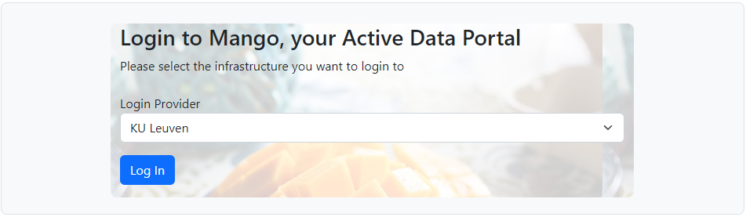  

Choosing 'KU Leuven' will direct you to the KU Leuven login page, unless you already were logged in in another tab, in which case this step is skipped.    
On the next page, select your iRODS zone.   
You should be redirected to the main page of the ManGO portal:  

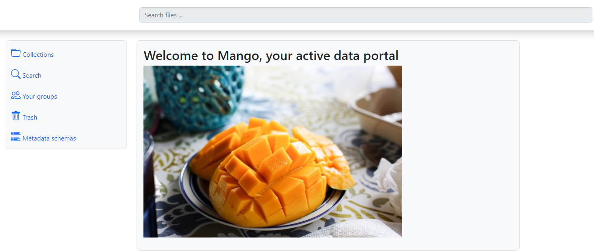    

## The collections tab

### Navigating

When you log in, you can see a menu on the left side of the page, with the different tabs.  
The **Collections** tab allows you to navigate and organize your data in the central pane.  

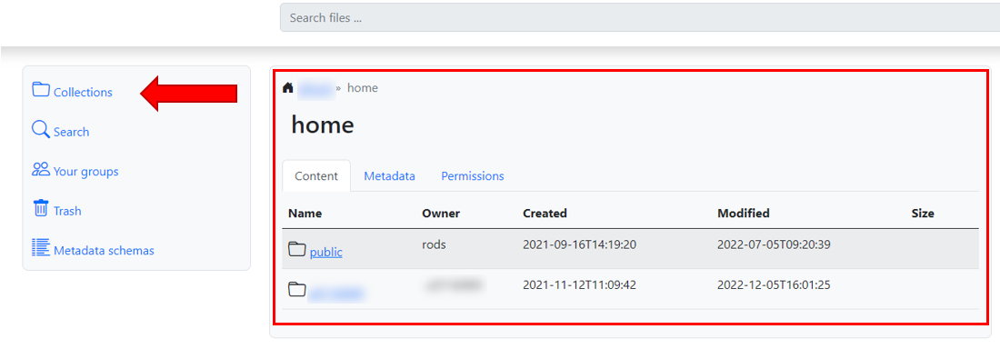  

By default, you start in the 'home' collection. There you should see: 
- Your home collection 
- The collection of your group 
- The public collection

To navigate to a collection, you just click on it.  
Just under the search bar, there is a handy breadcrumb menu, which allows you to go back to previous collections:  

To create a collection, you click on the blue 'add collection' button, and specify a name.  

**Note:** If the 'Add collection' and 'Upload files ...' buttons are missing, that means you don't have permissions to write to the collection you are currently in. 

### Uploading and downloading files

To upload one or multiple files, click on the 'Upload files... button'.  
From here, there are two ways to upload files:  
  1. Open your local file explorer, and drag file to 'Drop files here to upload'  
  2. Click on 'Drop files here to upload' and browse your pc  
Note that you can upload multiple files in one go.   

After this step, you will see the file as data object in your collection:    

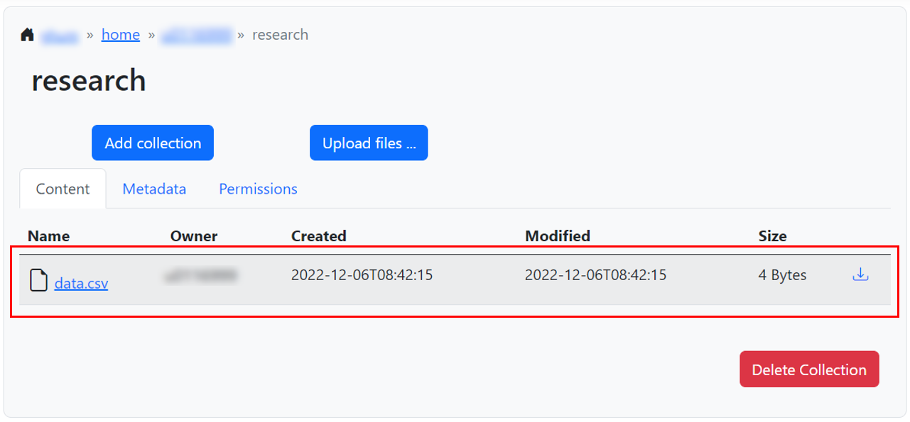  

To download a data object, click on the blue download icon on the right of it.    
It will end up in your local Downloads directory.    

### Moving, copying and renaming data

These actions are planned to be added in a later version.   
At the moment, you can work around this by (removing and) reuploading data objects with the correct name/destination.    

### Deleting data

To delete a collection, click on it to show that collection's page.    
You can find the red 'Delete' button in the lower left corner.   
The same method applies for data object.  

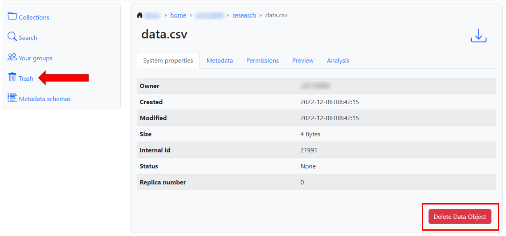

Any data you delete gets sent to your 'trash' collection.      
For example, if you remove the file with path `/<zone>/home/<username>/research/results.txt`, it will end up at `/<zone>/trash/home/<username>/research/results.txt`.    
You can reach the trash collection by clickin on the 'trash' tab on the left of the screen.     
There it stays for 15 days, after which it is automatically deleted.  

If you want to recover data you deleted within this period, please contact the administrators via rdm-icts@kuleuven.be.    
In later versions, you will be able to move deleted data back to your home directory.    

## A deeper look

If you click on the name of a collection or data object, you go to a page with more info about that object.  
These pages are split in different tabs.    
We'll discuss them one by one:    

### Contents (collections)

Under 'Contents', you can see the subcollections and data objects inside a collection.  
This has been discussed in the previous chapter.  
For now, you can work around this (at least for data objects) by (removing and) reuploading files, optionally with a new name and/or location.    

### System properties (data objects)

This tab shows you some basic information that the system has about a data object, like its owner or the time it was last modified.    
You can also search for data objects based on this information in the search tab (see [Searching](#searching)).  

### Metadata

ManGO allows you to user metadata (data about data) to both collections and data objects, in the form of Attribute-Value-Units triples (AVU's).  
These labels allow you:  
  - To add contextual information to your data
  - To search your data via the search tab (see [Searching](#searching))
  - In some cases, it can even be used to automate processes.  

For example, you could add the attribute 'instrument' and value 'microscope A' to indicate the data has been generated by microscope A.    
The unit field is meant to indicate units like meters, hours, ... where necessary (e.g. 'time', '20', 'days'), but units are not mandatory.    

In this tab, you can add metadata manually per AVU, or you can apply a metadata schema (see [Metadata schema's](#metadata-schemas)).   

To add an AVU manually, click on the blue 'add metadata' button.  
Fill in your AVU in the popup that appears.   
Once you save, you will see this AVU appear in the metadata menu.   

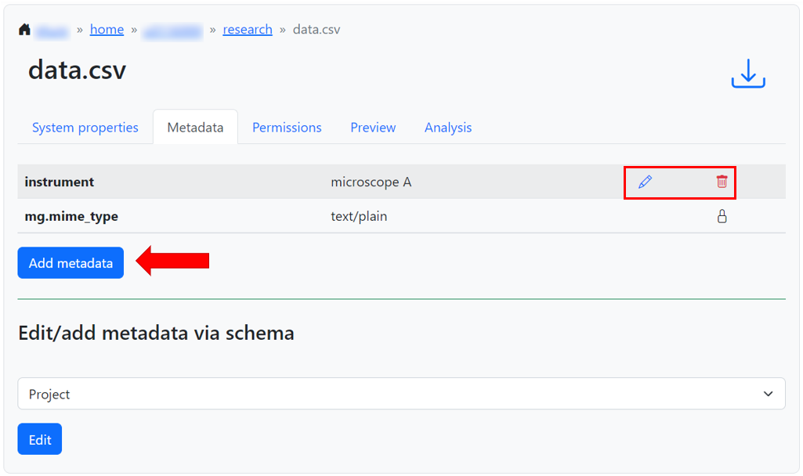  

You can edit any AVU you add later by clicking on the pencil next to it.    
To delete an AVU, click on the red trashbin next to it.  

### Permissions

In the tab 'permissions', you can see and change which groups have access to a certain collection.     
There are three [access levels](miscellaneous/practical_information_ACL.md) in ManGO:  
  - Read
  - Write
  - Own

To give any group access:  
- Select the group name from the drop-down menu on the bottom left  
- Select the desired access level on the drop-down next to it  
- In case you are applying permissions to a collection, select whether it needs to be applied recursively (to everything inside the collection) or only to the collection itself.  
- Click on 'apply'

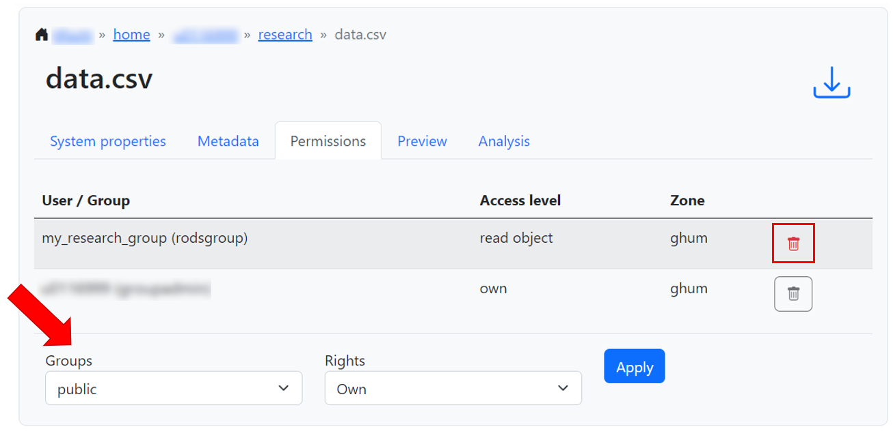  

You can afterwards remove any permissions by clicking on the red trashbin next to it.  
One exception: when you are the only one having own permissions, you cannot remove your own permissions.  
This way, we avoid cases where no one owns a data object/collection.  

**Note**: When giving permissions to groups, always consider whether the users can browse to the data.  
For example, if a data object is located at `/<zone>/home/<your_home>/research`, a group needs at least read access to your home and the research collection.  
Some other clients, like iCommands and the Python-iRODSclient allow users to go straight to a path instead of browsing.  
However, even in these cases, users need at least read access to the parent directory  

For collections, this tab also allows you to set or unset inheritance.  
If you activate inheritance, every collection or data object created under it will inherit the permissions of this collection.  

### Preview (data objects)

The preview tab gives an automatically generated preview of your data object.  
Please note that this is just a preview, and not a full rendering of the contents.  
The previews are currently available for a select number of file types (for example PDFs and PNG images).  

### Analysis (data objects)

A lot of file formats nowadays contain some metadata about the file itself in its header.  
For example, the header of a foto might contain data on when the picture was taken.  

The analysis tab allows you to extract this information with [Apache Tika](https://tika.apache.org/).  
To start, indicate whether you want OCR (Optical Character Recognition) or not, and click on 'Analyze with Tika Inspector'.  
This generates a list of all the metadata that the analyzer can find inside the file, and optionally the text of the file (depending on the file type).     

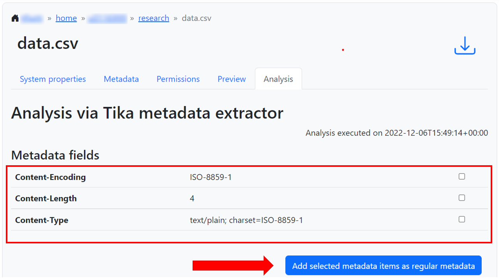

Next to each metadata item, you have a checkbox.    
You can click the checkboxes of metadata items you find useful (which are likely not all) and click on 'Add selected metadata items as regular metadata'.  
These will then pop up on in the metadata tab under the 'analysis' subtab.  

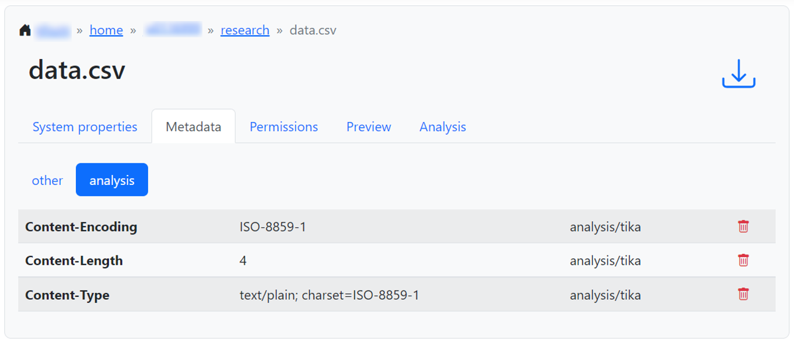

## Searching 

In the search tab, you can search for collections or data objects based on system properties, like name and creation date, and based on user-added metadata.  
To search for a collection or data object, select the right type under 'Type'.  
You can specify a collection to search in under 'collection (subtree)', but this is not mandatory.   
Then, you fill in the criteria you want to look for and click on 'Search'.  

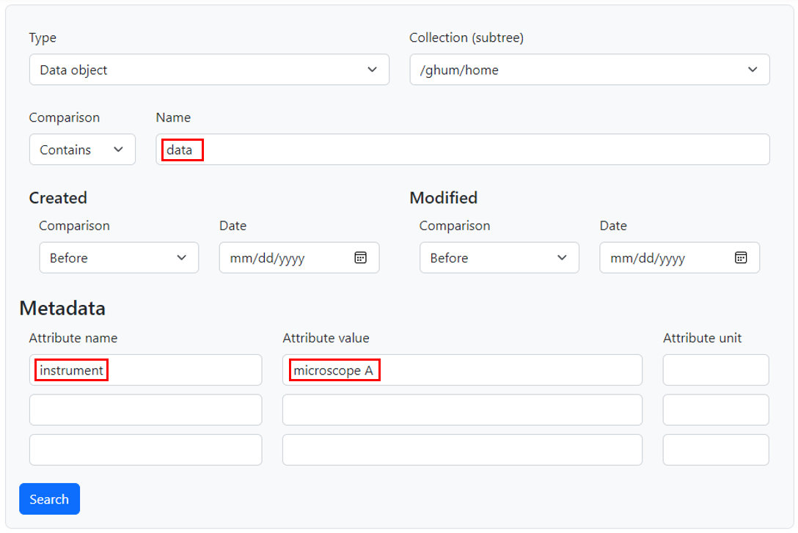

This gives you a list of all relevant collections/data objects (if any).  
To go to any collection/data object in the results, just click on the link (which should be in blue).  

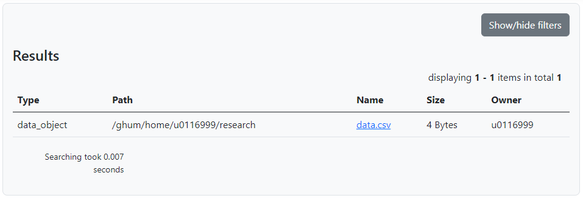  

> **Note:** There is also a search bar at the top of the page.  
> It is meant to provide a more freeform search, like Google, in later versions of the portal.    
> Since this feature is not available yet, the search bar is blocked for now.  

## Metadata schema's

Earlier, we showed how you can apply metadata manually.   
Another option is to apply metadata via predefined schema's.   
This has two advantages:  
- It's harder to make mistakes 
- It saves time

### Creating a schema

To create a new schema, click on the tab 'Metadata schema's' on the right, and then on 'Create new template' at the bottom.  
In the following popup, give a name to your schema.  
Then, you can start adding elements:  

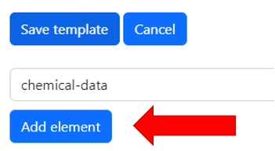  

A new popup will open, where you can choose between kinds of elements to add to your template:  
- Text input  
- Select: selecting one option from a dropdown list (of at least 5 elements)  
- Checkboxes: selecting one/multiple options from a list
- Radio buttons: selecting one option from a list
- Object: create a combination of fields
  - For example, you can create an 'author' object with a text field for first name and a dropdown for selecting their institute  

Click on any of these options and you will be asked for an ID and a name for the label.  
The ID should be something descriptive, in lowercase, without spaces.  
The label is what the user will see.  
After that, you will need to specify what kind of input the user can give (differs per element type).  
Click on 'submit' to verify the creation of your element.  

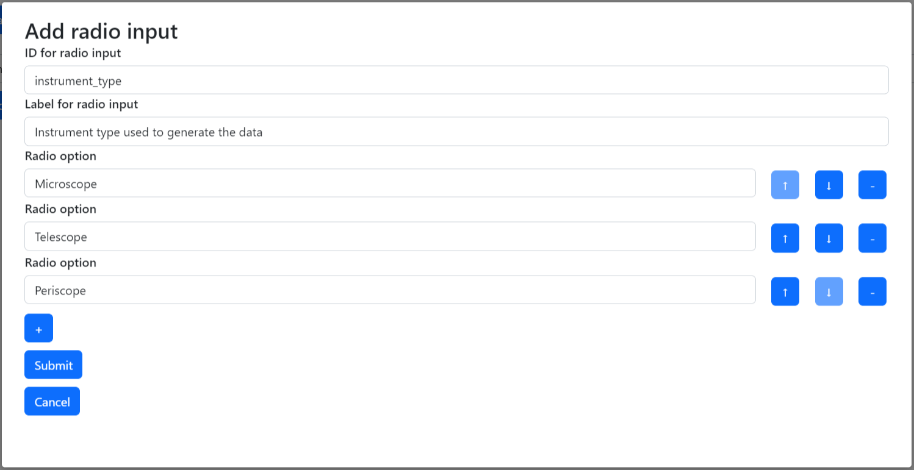  

You can keep creating elements until you are happy with your schema.  
If an element should be mandatory, don't forget to tick the 'required' checkbox.  
When you are ready, click on 'submit template'.  

If you want to make changes later, you can always return to the metadata schema tab and edit your schema.  
Deleting a schema will be possible in later versions.  

### Applying a schema

To apply a schema, go to the collection tab and browse to the collection/data object you would like to apply it to.  
Then, go to the metadata tab of that collection/data object.  
Under 'Edit/add metadata via schema', select your schema and click on 'Edit'.  

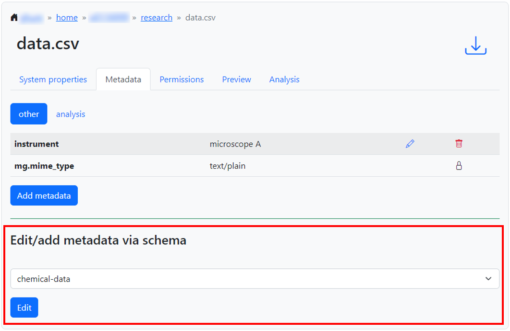   

This will create a pop-up where you can fill in all metadata.  
After you click on 'save', the metadata tab of your collection/data object will have an extra tab with the name of your schema. 

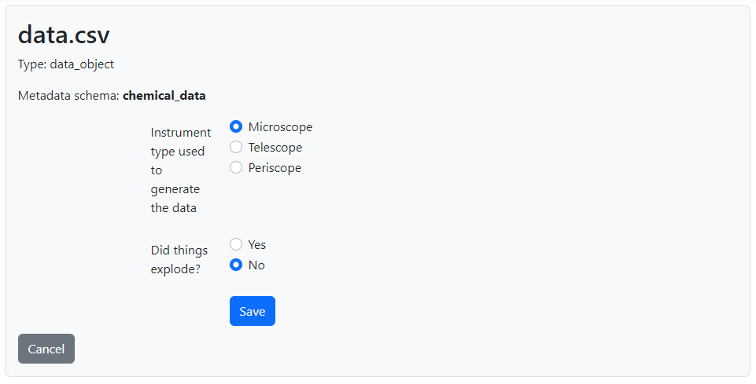  

In the search tab, you can now also search based on the schema of the metadata.  
However, instead of typing the attribute name, under 'Attribute name' you type `mg.<schema_name>.<element-identifier>`:   

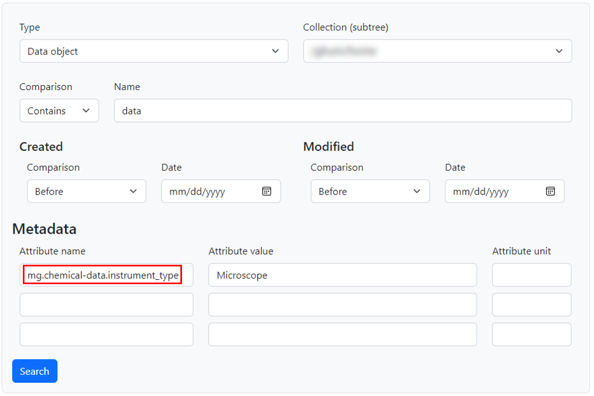  

# Exercises

Let's do the exercises below!

You can find the files used for the exercises in the [git repository](https://github.com/hpcleuven/KULeuven-iRODS-User-Training) of this training, in the 'data' folder.

You can download the repository as a Zip-file by clicking on the green 'code' button and selecting 'Download ZIP'.
Alternatively, you can clone the repository from the command line.

**Exercise 1: uploading and organizing**

In this exercise, you will use the file inflation.txt from data/economy.

- Create two collections called 'earth_science' and 'economy'.
- Upload inflation.txt to the collection 'earth_science'.
- You suddenly relialize that what you just did doesn't make sense. This file belongs in 'economy'! Remove the file you just uploaded.
- Move into the 'economy' collection and reupload the file there. 
- Remove the 'earth_science' collection.
- You can now also delete the 'inflation.txt' file in your local directory.

**Exercise 2: downloading and overwriting**

- You realise there is a mistake in the uploaded data object.
  Download the file and edit it so the inflation for 2021 is 1.4%.
- Upload the new version of the file, overwriting the previous one.

**Exercise 3: managing permissions**

In this exercise, you will use the files patient1.csv and anonymized.csv from data/lifescience.

- Make a collection called 'lifescience' in your home and upload both files to it.  
- Give your group read access to the collection lifescience, recursively.  
- Oh no, we forgot something! While the data in anonymized.csv is anonymized, the other file contains sensitive data!  
  Remove the read permissions for the group from patient1.csv.  
- Later, your colleagues mention they need to upload some new files to the lifescience collection.  
  Give your group write access to the lifescience collection (without changing the permissions of anonymized.csv and patient1.csv)  

**Exercise 4: working with metadata**

In this exercise, you will use the files corpus1.txt, corpus2.txt and corpus3.txt from data/languages.

- Make a collection called 'languages' and upload the files to it.  
- Add the following AVU's to the files:  
    - Attribute 'language' and value 'dutch' to corpus1.txt  
    - Attribute 'language' and value 'french' to corpus2.txt  
    - Attribute 'language' and value 'latin' to corpus3.txt  
- Oops, we made a mistake! Open the file corpus2.txt, and look what the language is.  
  Overwrite the current AVU with one with the correct value.  
- Go to the 'search' tab and search for all files with Metadata Attribute Name 'language' and Metadata Attribute Value 'latin'.  

**Exercise 5: metadata schemas**

In this exercise, you will use the file bird.JPG from data/biology, which depicts a nice specimen of the 'European roller'.

- Make a Metadata schema with the name 'animals'.
  This schema should contain the following:

  - A 'name' field where the user can type the name of the animal
  - A 'type' field, with the following options:
    - 'Mammal'
    - 'Bird'
    - 'Fish'
  - A 'flies' field, with the following options:
    - 'Yes'
    - 'No'
    - 'Only on weekdays'

  All fields should be required. 

- Create a collection called 'biology' and upload bird.JPG to it.
- Apply the template to bird.JPG.

